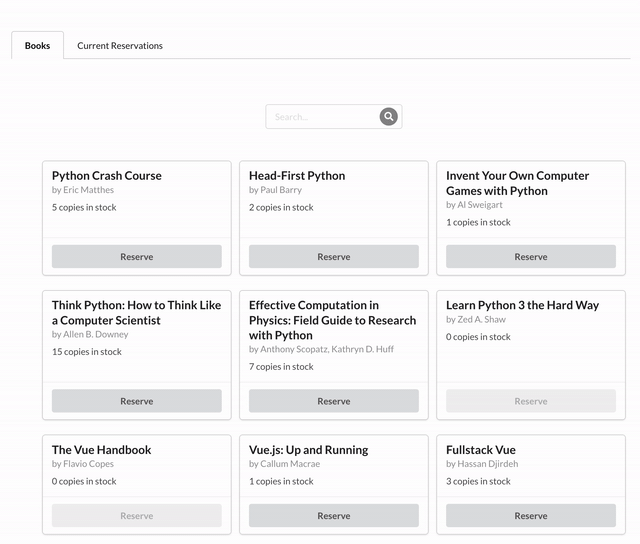

# saasvile

## Getting started

Start the Python/Django backend. 
- Install [pipenv](https://pypi.org/project/pipenv/) for your OS.
- Activate the virtual environment: `cd saasvile-be; pipenv shell`
- Install the dependencies: `pipenv install`.
- Load seed data: `python manage.py loaddata kira`
- Start the server: `python manage.py runserver`

In a second terminal, start the JS/React/Redux frontend.
- `cd saasvile-fe`
- `npm install && npm start`

## Cutting corners / Design decisions
- Testing: Need to add tests for both the frontend and the backend.
- Linting: Should set up a linter to automatically check the code on commits.
- Book search: Searching was deliberately implemented on the backend for this project. It's much simpler to just add it to the frontend but if we want hundred of books in the system, we would need to implement paging and search would therefore end up in the backend anyways.
- Edge cases: Many have not been handled, especially at the backend. For example, the backend should not allow reserving more books than are available. 
- Code cleanup: This code can be cleaned up quite a lot. For example, my react components should be broken down into smaller ones so that it is easy to reuse them.
